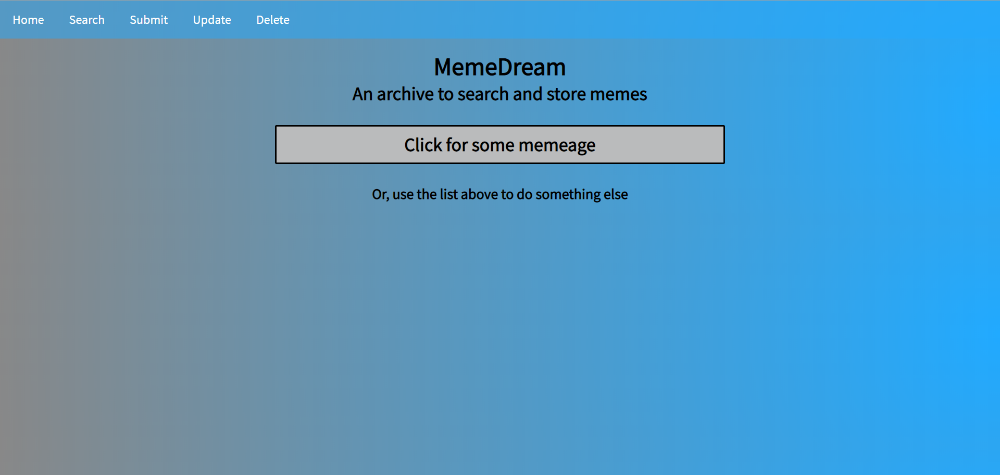
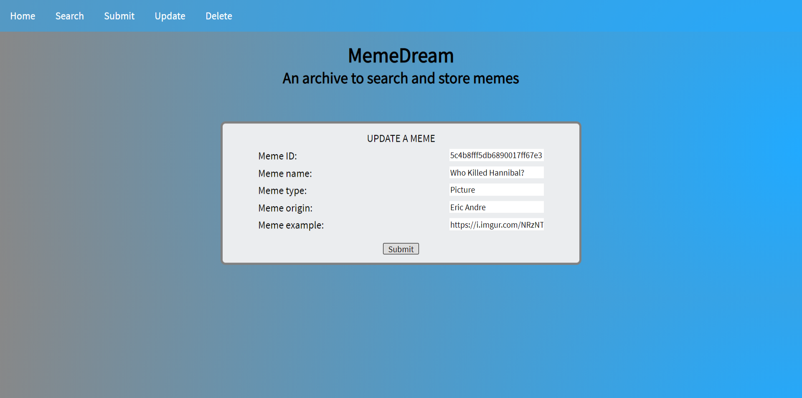
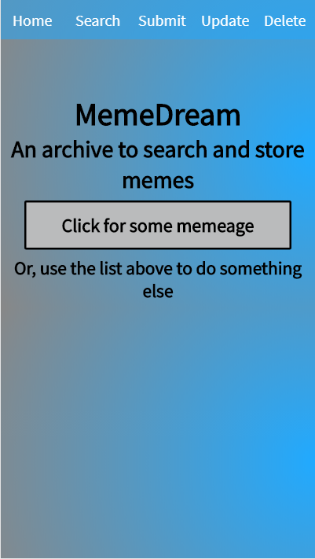

<h1>MemeDream</h1>
<h2>A place to store and search memes from around the web</h2>

Created by Race Briggs for the Thinkful Coding School capstone project

Hosted at: https://sheltered-fortress-34693.herokuapp.com/

----------------------------------------------------------------------------------------------------------------------------------------

<h2>Instructions</h2>

MemeDream is fairly easy to use. Simply click the main button to get the current collection of memes, or select one of the other options from the top nav-bar to reach other functions. The app will make calls to the resting API in order to perform your desired query.

The only strangely specific action one must perform comes when updating the meme. If you know the ID for the meme, then you won't have to do this, however in order to make it easier for everyday users who do not want to write down a 20+ digit randomized ID, I added another option. If you search for a meme, or simply populate the collection on the landing page, and you click on any of the memes it will copy the entry's information. You can then subsequently click on the update tab, which will have the various forms automatically populate with all of the meme's current information.

----------------------------------------------------------------------------------------------------------------------------------------

<h2>Technologies</h2>

The MemeDream app uses a multitude of technologies, including:

<ul>
  <li>Node.js</li>
  <li>Espress</li>
  <li>MongoDB</li>
  <li>Mongoose.js</li>
  <li>Chai</li>
  <li>Mocha</li>
</ul>

MemeDream also incorporates TravisCI for external testing and deployment, and Heroku for the hosting of the app.

----------------------------------------------------------------------------------------------------------------------------------------

<h2>Screenshots</h2>

