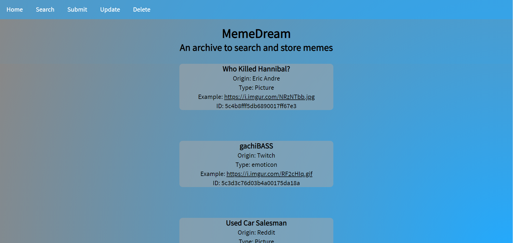
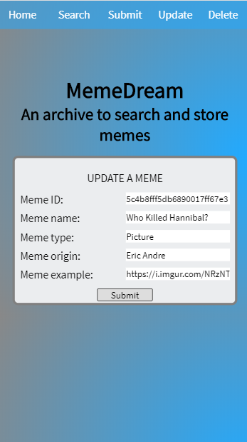

<h1>MemeDream</h1>
<h2>A place to store and search memes from around the web</h2>

Created by Race Briggs for the Thinkful Coding School capstone project

Hosted at: https://sheltered-fortress-34693.herokuapp.com/

----------------------------------------------------------------------------------------------------------------------------------------

<h2>Instructions</h2>

MemeDream is fairly easy to use. Simply click the main button to get the current collection of memes, or select one of the other options from the top nav-bar to reach other functions. The app will make calls to the resting API in order to perform your desired query.

Update and delete functionality are on the results entry. Simply use one of the buttons on the meme, and follow the prompts for the desired edit or deletion.

----------------------------------------------------------------------------------------------------------------------------------------

<h2>Technologies</h2>

The MemeDream app uses a multitude of technologies, including:

<ul>
  <li>Node.js</li>
  <li>Espress</li>
  <li>MongoDB</li>
  <li>Mongoose.js</li>
  <li>Chai</li>
  <li>Mocha</li>
</ul>

MemeDream also incorporates TravisCI for external testing and deployment, and Heroku for the hosting of the app.

----------------------------------------------------------------------------------------------------------------------------------------

<h2>Screenshots</h2>

